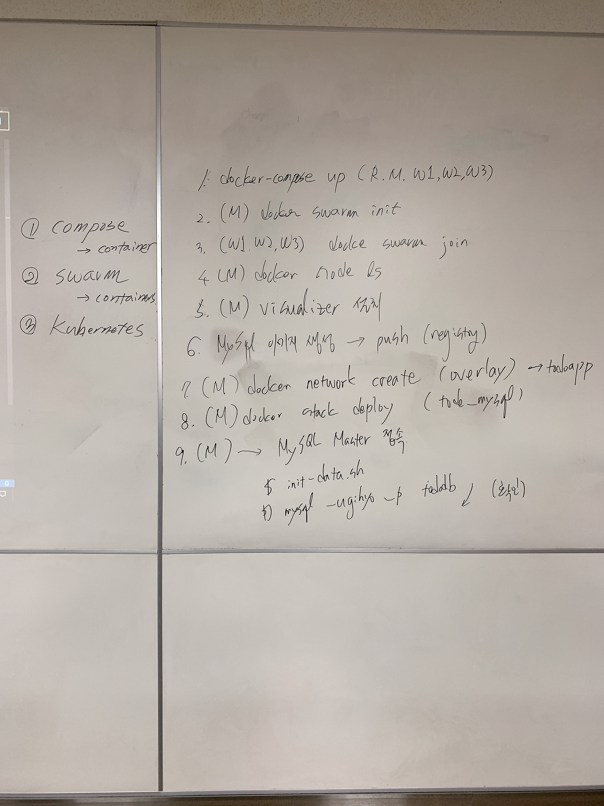

# 4장. 스웜을 이용한 실전 애플리케이션 개발

##### Master/Slave 구조 구축

1. #docker stack deploy -c /stack/todo-mysql.yml todo_mysql
2. #docker service ls
3. docker exec -it manager docker service ls
4. n9znxlhv4qwh        서비스 아이디를 복사
5. docker service ps n9znxlhv4qwh
6. regusu5tbip2        todo_mysql_master.1   registry:5000/ch04/tododb:latest   a5228f4e26d6        Running             Running 2 days ago  마스터의 노드를 복사
7. PS C:\Users\HPE> docker exec -it a5228f4e26d6 sh 접속
8. docker ps
9. docker exec -it 684ffde2e49d bash 컨테이너 아이디에 접속 

다른 접속방법

1. 마스터 : docker service ps todo_mysql_master --no-trunc --filter "desired-state=running" --format "docker container exec -it {{.Node}} docker containe
   r exec -it {{.Name}}.{{.ID}} bash"
2. 슬레이브 : docker service ps todo_mysql_slave --no-trunc --filter "desired-state=running" --format "docker container exec -it {{.Node}} docker container exec -it {{.Name}}.{{.ID}} bash"
3. 결과 : docker container exec -it a5228f4e26d6 docker container exec -it todo_mysql_master.1.regusu5tbip27pr1igrkltd26 bash
4. docker container exec -it 521b7c109455 docker container exec -it todo_mysql_slave.1.scuphbti05ogt4ecuanpz28w3 bash
   docker container exec -it c6124b2cd262 docker container exec -it todo_mysql_slave.2.52os7899lomhdtzdcp5xg95z2 bash
5. 위의 결과를 윈도우즈  > 에서 실행 하여 접속한다.
6. ls -al /usr/local/bin
7. init-data.sh
8. mysql -ugihyo -p tododb
9. mysql> SELECT * FROM todo LIMIT 1\G
   *************************** 1. row ***************************
        id: 1
     title: MySQL 도커 이미지 만들기
   content: MySQL 마스터와 슬레이브를 환경 변수로 설정할 수 있는 MySQL 이미지 생성
    status: DONE
   created: 2020-01-06 00:50:43
   updated: 2020-01-06 00:50:43
   1 row in set (0.00 sec)
10. 슬레이브도 똑같은 방법으로 접속후 "SELECT * FROM todo LIMIT 1\G" 명령어 실행하기

1. docker exec -it work03 sh
2. #docker ps 실행중인 컨테이너 아이디 복사
3. #docker exec -it 157ac73eb42c sh
4. #apt-get install -y net-tools
5. #ifconfig
6. #mysql -u gihyo -p tododb
7. mysql> select * from todo

1. docker image build -t ch04/todoapi:latest
2. docker images
3. docker push localhost:5000/ch04/todoapi:latest - 레지스트리 추가? 
4. docker exec -it manager sh
5. docker stack ls
6. cat /stack/todo-app.yml
7. docker stack deploy -c /stack/todo-app.yml todo_app
8. docker service ls
9. docker service logs -f todo_app_api
10. docker service ls
11. docker service ps zu14lqy40t86
12. exit
13. docker exec -it a5228f4e26d6 sh
14. #docker ps
15. #docker exec -it 6e7e39abe5c8 bash
16. apt-get update
17. apt-get install -y net-tools
18. hostname -i
19. ifconfig
20. netstat -ntpl
21. work01 말고 다른곳에 설치된 api도 같은 방법으로 주소 확인

#### 접속 가능 확인 

1. apt-get install -y curl
2. curl -XGET http://todo_app_api:8080/todo?tatus=DONE
3. 두번 입력엔터 해야 정상작동

#### Nginx 구축

강사님 파일을 전부 다운받고

1. docker image build -t ch04/nginx:latest .
2. docker image tag ch04/nginx:latest localhost:5000/ch04/nginx:latest
3. docker image push localhost:5000/ch04/nginx:latest
4. $ docker exec -it manager docker stack deploy -c /stack/todo-app.yml todo_app

curl http://localhost:5000/v2/_catalog

| work01 //a5228f4e26d6 | 172.26.0.4       | work02 //521b7c109455 | 172.26.0.6       | work03 //c6124b2cd262 | 172.26.0.5      |
| --------------------- | ---------------- | --------------------- | ---------------- | --------------------- | --------------- |
| todo_mysql_master     | 10.0.4.3 //3306  | todo_mysql_slave      | 10.0.4.5 //3306  | todo_mysql_slave      | 10.0.4.6 //3306 |
| todo_app_api          | 10.0.4.12 //8080 | todo_app_api          | 10.0.4.11 //8080 |                       |                 |
|                       |                  | todo_app_nginx        | 10.0.4.15 //     | todo_app_nginx        |                 |
|                       |                  |                       |                  |                       |                 |
|                       |                  |                       |                  |                       |                 |

## 시험

#### IP 확인하는 3가지 명령어

#### ifconfi

#### g

#### ip addr show 

#### hostname -i

