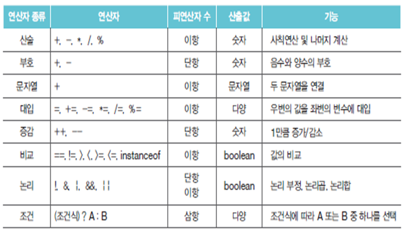
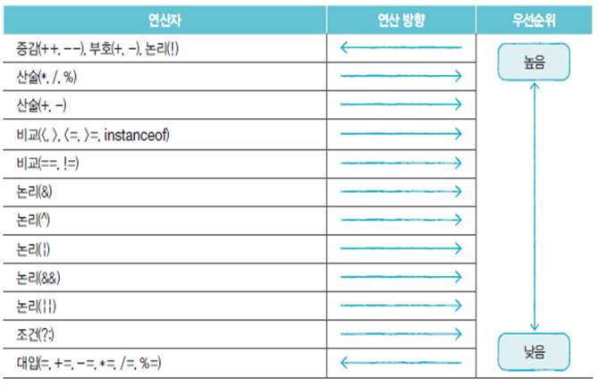
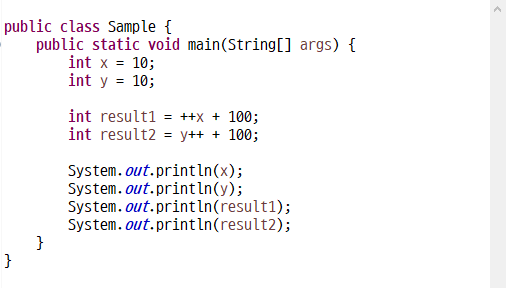

s1 의 주소가 Ox1234 --- 값은 "java"

s2 의 주소는 Ox5678 --- 값은 "java"

s1==s2 연산을 하면 false 가 나온다 

==은 주소를 비교 

값을 비교하고 싶다면 equals 를 사용

s1.equals(s2);

```java
	public static void main(String[] args) throws IOException {
		int x = 5;
		System.out.println( x == 5 );	// true
		System.out.println( x == 6 );	// false
		
		//	s1과 s2는 동일한 메모리 공간을 참조
		//	s3와 s4는 각각의 메모리 공간을 참조
		String s1 = "Java";						
		String s2 = "Java";
		String s3 = new String("Java");
		String s4 = new String("Java");

		System.out.println( s1 == s2 );		// true  ⇐ 값 비교, 동일 주소이므로 true
		System.out.println( s1.equals(s2) );	// true  ⇐ 내용 비교
		System.out.println( s3 == s4 );		// false ⇐ 값 비교, 주소가 다르므로 false
		System.out.println( s3.equals(s4) );	// true
		System.out.println( s1 == s3 );		// false
		System.out.println( s1.equals(s3) );	// true		
	}
```


#### 연산자와 연산식

연산자(operator) : 연산에 사용되는 표시나 기호

피연산자(operand) : 연산자와 함께 연산되는 데이터

연산식(expression) : 연산자와 피연산자를 사용하여 연산 과정을 기술한 것


#### 연산자 종류



#### 연산자의 우선순위




#### 증감 연산자(시험 가능성)




