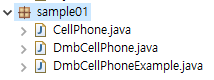

### 접근 제한자(access modifier)

클래스와 인터페이스 및 이들이 가진 멤버(필드,메소드)의 접근을 제한

-  public : 외부 클래스가 자유롭게 사용할 수 있도록 허용
-  protected :  같은 패키지 또는 자식 클래스에서 사용할 수 있도록 허용
-  default : 같은 패키지에 소속된 클래스에서만 사용할 수 있도록 허용
-  private : 외부에서 사용할 수 없도록 제한


**protected**

다른 패키지에서 사용불가.

상속관계인 경우 예외적으로 다른 패키지에서 사용가능


**default**

다른 패키지에서 사용불가


#### 클래스 접근 제한

같은 패키지 내에서만 사용할 수 있도록 허용할 것인지, 다른 패키지에서도 사용할 수 있도록 허용할 것인지를 결정


#### 생성자 접근 제한

생성자 호출 가능 여부를 결정


```JAVA
package modifier;

public class A {
	// 필드
	A a1 = new A(true);
	A a2 = new A(1);
	A a3 = new A("문자열");
	
	// 생성자를 오버로딩하고 있음
	//	public => 클래스 외부에서 호출 가능
	public A(boolean b) {}
	//	default => 동일 패키지 또는 자식 클래스에서만 호출 가능
	A(int i) {}
	//	private => 클래스 외부에서 호출 불가능
	private A(String s) {}
}
```

```java
package modifier;

public class B {
	// 	필드
	A a1 = new A(true);	// public 접근 제한자
	A a2 = new A(1); 		// default
      /* The constructor A(String) is not visible 컴파일 오류 발생
	A a3 = new A("문자열");	// private 
      */
}
```

#### 필드와 메소드 접근 제한

// 필드 선언

[ public | protected | private ] [ static ] 데이터타입 필드명;


//메소드 선언

[ public | protected | private ] [ static ] 리턴타입 메소드명 ( 매개변수 ) { 메소드본문 };


```java
package modifier;

public class A {
	// 필드
	public int field1;		// 클래스 외부에서 직접 접근이 가능
	int field2;				// 동일 패키지 또는 자식 클래스에서 직접 접근이 가능
	private int field3;		// 클래스 외부에서 접근이 불가능
	
	// 생성자
	public A() {
		field1 = 1;
		field2 = 2;
		field3 = 3;
		
		method1();
		method2();
		method3();
	}
	
	// 메소드
	public void method1() { 
		System.out.println(field1);
	}
	void method2() { 
		System.out.println(field2);
	}
	private void method3() { 
		System.out.println(field3);
	}
	
}
```


```java
package modifier;

public class B {
	public B() {
		A a = new A();
		a.field1 = 10;
		a.field2 = 20;
		/* private => 직접 접근이 불가능
		a.field3 = 30;
		*/
	}
}
```

**package modifier2;**

```java
package modifier2;
import modifier.A;

public class C {
	public C() {
		A a = new A();
		a.field1 = 100;
		/*
		a.field2 = 200;	// default => 패키지가 상이하므로 접근할 수 없음
		a.field3 = 300;	// private => 클래스 외부에서 접근할 수 없음
		*/
		
		a.method1();
		/*
		a.method2();
		a.method3(); 	// 위와 동일
		*/
	}
}

```


#### getter/setter 메소드

객체의 무결성을 보장하기 위한 방법

필드를 private 제한하고, 해당 필드들에 접근할 수 있는 public 메소드를 제공하는 방식으로 객체의 무결성을 보장 ==> 캡슐화

필드의 값을 외부로 반환하는 메소드 ==> getter

필드의 값을 외부에서 전달하는 겂으로 설정하는 메소드 ==> setter

```java
public class Car {
	//	필드
	private int speed;
	
	public int getSpeed() {
		return speed;
	}
	public void setSpeed(int speed) {
		//	속도를 제한
		if (speed < 0 || speed > 100) 
			this.speed = 0;
		else 
			this.speed = speed;
	}

	private boolean stop;
    
    public boolean isStop() {
		return stop;
	}
	public void setStop(boolean stop) {
		this.stop = stop;
		if (stop == true) {
			this.speed = 0;
		}
	}	
}
```


### 상속

기존에 만들어져 있는 클래스를 재활용


#### 클래스 상속

-  자식 클래스 선언 시 부모 클래스를 선택
-  extends 키워드 뒤에 부모 클래스를 기술
-  여러 개의 부모 클래스를 상속할 수 있음
-  부모 클래스의 private 접근 제한을 갖는 필드와 메소드는 상속 대상에서 제외
-  부모와 자식 클래스가 다른 패키지에 존재할 경우, default 접근 제한되 필드와 메소드 역시 제외


```java
public class People {
	private String name;
	private String ssn;
	
	public String getName() {
		return name;
	}

	public void setName(String name) {
		this.name = name;
	}

	public String getSsn() {
		return ssn;
	}

	public void setSsn(String ssn) {
		this.ssn = ssn;
	}

	public People(String name, String ssn) {
		this.name = name;
		this.ssn = ssn;
	}
}
```

```java
public class Student extends People {
	public int studentNo;
	
	public Student(String name, String ssn, int studentNo) {
		super(name, ssn);
		this.studentNo = studentNo;
	}
}
```

```java
public class StudentExample {
	public static void main(String[] args) {
		Student s = new Student("홍길동", "123456-1234567", 7777);
		
		System.out.println("이름: " + s.getName());
		System.out.println("주민번호: " + s.getSsn());
		System.out.println("학번: " + s.studentNo);
	}
}
```


CellPhone	

-  model											
-  color                  
-  powerOn()
-  powerOff()
-  bell()
-  sendVoice()
-  hangUp()


DmbCellPhone

- channel

-  turnOnDmb()
-  changeChannelDmb()
-  turnOffDmb()



```java
package sample01;

public class CellPhone {
	//	필드
	String model;
	String color;
	
	//	생성자
	
	//	메소드
	void powerOn() {
		System.out.println("전을 켭니다.");
	}
	void powerOff() {
		System.out.println("전을 끕니다.");
	}
	void bell() {
		System.out.println("벨이 울린다.");
	}
	void sendVoice(String message) {
		System.out.println(">>> " + message);
	}
	void receiveVoice(String message) {
		System.out.println("<<< " + message);
	}
	void hangUp() {
		System.out.println("전화를 끊습니다.");
	}
}
```

```java
package sample01;

public class DmbCellPhone extends CellPhone {
	// 	필드
	int channel;
	
	// 	생성자
	DmbCellPhone(String model, String color, int channel) {
		//	super(model, color);
		this.model = model;
		this.color = color;
		this.channel = channel;
	}
	
	// 	메소드
	void turnOnDmb() {
		System.out.printf("채널 %d번 DMB 방송 수신을 시작합니다.\n", channel);
	}
	void turnOffDmb() {
		System.out.println("DBM 방송 수신을 종료합니다.");
	}
	void changeChannelDmb(int channel) {	
		this.channel = channel;
		System.out.printf("채널 %d번으로 변경합니다.\n", channel);
	}
}
```

```java
package sample01;

public class DmbCellPhoneExample {
	public static void main(String[] args) {
		// DmbCellPhone 객체 생성
		DmbCellPhone dmbCellPhone = new DmbCellPhone("자바폰", "검정", 10);

		// CellPhone으로부터 상속 받은 필드
		System.out.println("모델: " + dmbCellPhone.model);
		System.out.println("색상: " + dmbCellPhone.color);

		// DmbCellPhone의 필드
		System.out.println("채널: " + dmbCellPhone.channel);

		// CellPhone으로부터 상속 받은 메소드 호출
		dmbCellPhone.powerOn();
		dmbCellPhone.bell();
		dmbCellPhone.sendVoice("여보세요");
		dmbCellPhone.receiveVoice("안녕하세요! 저는 홍길동인데요");
		dmbCellPhone.sendVoice("아~ 예 반갑습니다.");
		dmbCellPhone.hangUp();

		// DmbCellPhone의 메소드 호출
		dmbCellPhone.turnOnDmb();
		dmbCellPhone.changeChannelDmb(12);
		dmbCellPhone.turnOffDmb();
	}
}
```


#### 메소드 재정의(오버라이딩, overriding)

부모 클래스의 메소드가 자식 클래스에서 사용하기에 부적합할 경우, 자식 클래스에서 수정해서 사용 ⇒ 메소드가 재정의되면 부모 객체에 정의된 메소는 숨겨지고, 자식 객체에서 메소드를 호출하면 재정된 자식 메소드가 호출됨

##### 메소드 재정의 방법

-  부모 메소드와 동일한 시그니처를 가져야 한다.
-  접근 제한을 더 강하게 재정의 할 수 없다.
-  새로운 예외를 throws 할 수 없다.


##### 부모 클래스의 메소드를 호출

자식 클래스 내부에서 재정의한 부모 클래스의 메소드를 호출해야 하는 경우, super 키워드를 붙여서 명시적으로 호출해야 함


```java
package sample2;

public class Airplane {
	public void land() {
		System.out.println("착륙");
	}
	public void fly() {
		System.out.println("비행");
	}
	public void takeOff() {
		System.out.println("이륙");
	}
}
```

```java
package sample2;

public class SupersonicAirplane extends Airplane {
	public static final int NORMAL = 1;
	public static final int SUPERSONIC = 2;
	
	// 	비행모드 = 1 : 일반비행, 2 : 초음속비행
	public int flyMode = NORMAL;
	
	//	메소드 오버로딩
	public void fly() {
		if (flyMode == SUPERSONIC) {
			System.out.println("초음속비행");
		} else {
			//	부모 클래스의 메소드를 호출
			super.fly();
		}
	}
}
```

```java
package sample2;

public class SupersonicAirplaneExample {
	public static void main(String[] args) {
		SupersonicAirplane sa = new SupersonicAirplane();
		
		sa.takeOff();
		sa.fly();
		sa.flyMode = SupersonicAirplane.SUPERSONIC;
		sa.fly();
		sa.flyMode = SupersonicAirplane.NORMAL;
		sa.fly();
		sa.land();
		
	}
}
```


#### final

-  해당 선언이 최종 상태이며, 수정될 수 없음을 의미
-  클래스 및 메소드 선언 시 final 키워드를 사용하면 상속 및 재정의를 할 수 없음


```java
package sample3;

public class Car {
	public int speed;
	
	public void speedUp() {
		speed += 1;
	}
	
	//	final 구문을 이용해서 재정의되는 것을 방지
	public final void stop() {
		speed = 0;
		System.out.println("차를 멈춤");
	}
}
```

```java
package sample3;

public class SportsCar extends Car {
	public void speedUp() {
		speed += 10;
	}
	
	/*
	// final로 정의된 메소드는 재정의할 수 없음
	// Cannot override the final method from Car
	public void stop() {
		speed = 0;
		System.out.println("차를 멈춤");
	}
	*/
}
```

### 다형성

사용 방법은 동일하지만 다양한 객체를 활용해 여러 실행 결과가 나오도록 하는 성질

다형성 ⇒ 메소드 재정의(overriding)와 타입 변환(promotion, casting)으로 구현


#### 자동 타입 변환(promotion)


바로 위 부모가 아니라도 상속 계층에서 상위 타입인 경우 자동으로 타입 변환이 가능


부모 타입으로 자동 타입 변환 이후에는 ==부모 클래스에 선언된 필드와 메소드만 접근==이 가능예외적으로 메소드가 자식 클래스에서 ==재정의된 경우, 자식 클래스의 메소드가 대신 호출==


#### 필드의 다형성

필드의 데이터 타입을 부모 클래스 타입으로 선언


