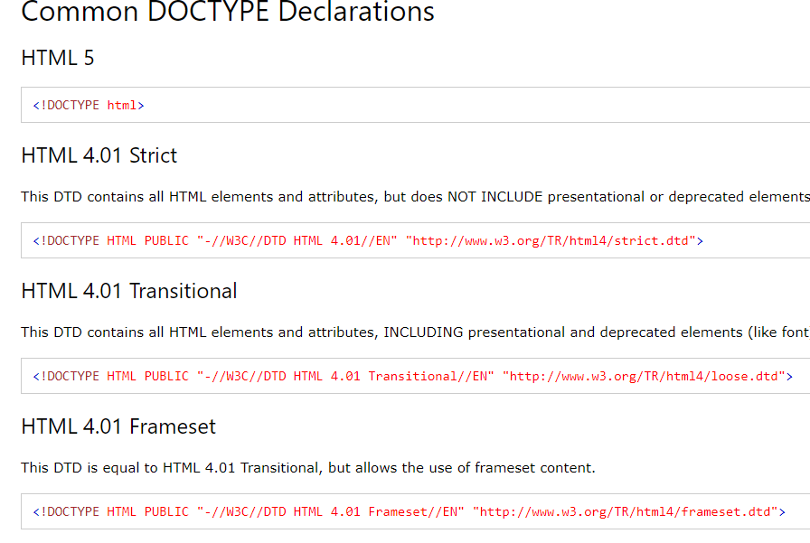

# 자바스크립트의 역사

#### Javascript란?

ECMAScript

- 웹 브라우저에서 많이 사용하는 프로그래밍 언어
- 넷스케이프 사의 "브랜든 아이히"에 의해 '모카'라는 이름으로 시작
- 넷스케이프 사가 썬 마이크로시스템과 함께 자바스크립트라는 이름을 붙이고 본격적 발전


서버 : 뭔가를 줌 (자원을 가짐)

1. 정적자원 - 내용을 바꾸지 않는한 항상 동일한 내용을 보여줌
   - 이런 서비스를 하는 서버의 단점 - 자원들이 어디있는지 모른다면 요청하기 어렵다.
   - 야후가 옐로우북, 디렉토리 서비스로 해결?

2. 동적페이지 - 처음에는 CGI를 사용, jsp, asp,등등 으로 

클라이언트 : 달라고 요청

#### Web - HTTP 프로토콜 기반의

1. 요청-응답구조
2. Stateless => 상태관리(유지X)

#### 웹에서 웹 애플리케이션으로

- 초기의 웹
  - 변화 없는 정적 글자들의 나열
  - 웹은 하이퍼링크라는 매개체를 사용해 웹 문서가 연결된 거대한 책에 불과
- 자바스크립트의 등장
  - 웹 문서의 내용을 동적으로 바꾸거나 마우스 클릭 같은 이번트 처리
- 웹은 애플리케이션의 모습에 점점 가까워짐
  - 대표적인 예는 아래 그림과 같은 웹 문서 작성 도구
  - 구글, 마이크로소프트에서는 웹 브라우저만으로 워드, 엑셀, 파워포인트 같은 애플리케이션 
  - 웹 애플리케이션은 웹 브라우저만 있으면 어디서든 사용 가능 

#### 인터넷 연결 없이 웹 브라우저에서 실행 가능한 웹 애플리케이션

- 웹 애플리케이션
  - 스마트폰이나 스마트패드 내의 애플리케이션을 만들 때에도 자바스크립트 사용

# HTML 

### Hypertext Markup Language

- 다른환경의 머신과 정보를 교환하기 위해서 만들어짐

- ``` html
  <div>dat</div> 이런식
  ```

- 브라우저마다 너무 다양해지니 표준을 만듬 = HTML5

- 시멘틱 웹 - 의미기반 웹

- 정규화



##### HTML5 의 철학 - 개발의 편의성을 향상

수업에 node.js , Visual Studio Code 사용

**1. cmd**

C:\Users\HPE>cd \

C:\>cd javascript

C:\javascript>node --version
v13.5.0

**2. Visual Studio Code**

open folder - c:\javascript


URI 는 URL URN 으로 나뉜다

- https://www.naver.com/a/b/c
  - https - 스킴
  - www.naver.com - 호스트
  - /a/b/c - 경로

**3. http 서버를 설치!**

cmd 에서

C:\javascript>npm init -y

C:\javascript>npm install http-server -g

-g 옵션은 글로벌 - 어디서든 접근 가능하도록 설치 C:\Users\HPE\AppData\Roaming\npm\node_modules

**4. 서버를 실행**

C:\javascript>npx http-server

``` html
<!DOCTYPE html>
<html>
    <head>
        <title></title>
        <script>
            console.log("#1")
        </script>
        
    </head>
    
    <body>
        <div id="up">up</div>
        <script>
            console.log("#2")
            document.getElementById("up").innerText = "UP";
        </script>
        <div id="down">down</div>
    </body>
</html>
```

document.getElementById("up").innerText = "UP"; 

- id가 up 인 애를 UP으로 변경
- 순서대로 해석하기때문에 찾는id의 아래에 설정한다.
- 하지만 script 파일은 head 안에 들어있는것을 추천
- 그래서 event 사용

```html
<!DOCTYPE html>
<html>
    <head>
        <title></title>
        <script>
            window.onload = function() {
            console.log("#1")
            console.log("#2")
            document.getElementById("up").innerText = "UP";
            document.getElementById("down").innerText = "DOWN";
            }
        </script>
        
    </head>
    
    <body>
        <div id="up">up</div>
        <div id="down">down</div>
    </body>
</html>
```


# 기본용어

- ##### 표현식이란?

  - 값을 만들어내는 간단한 코드
  - 273, 18+28*2

- ##### 문장이란?

  - 하나 이상의 표현식이 모인 것
  - 문장이 모여 프로그램 구성
  - 문장의 끝에는 세미콜론을 찍어 문장의 종결을 알려줌
  - 하나의 표현식에도 세미콜론만 찍히면 문장

- ##### 키워드란?

  - 자바스크립트가 처음 만들어질 때 정해진 특별한 의미가 있는 단어
  - 모든 브라우저에서 표 2-1과 같은 28개의 키워드를 지원
  - 미래에 사용될 가능성이 있는 자바스크립트 키워드
    - w3c에서는 자바스크립트 프로그램 작성 시 아래 키워드를 사용하지 않기를 권고
    - const나 debudder 같은 키워드

- ##### 식별자

  - 자바스크립트에서 이름을 붙일 때 사용
  - 식별자의 예
    - 변수명과 함수명
  - 식별자 생성 시 규칙
    - 키워드를 사용 불가
    - 숫자로 시작하면 불가
    - 특수 문자는 _과 $만 허용
    - 공백 문자 포함 불가
  - 식별자로 사용 불가능한 단어
    - break, 273alpha, has space

- 식별자의 생성 규칙
  - 모든 언어가 사용 가능하나 알파벳 사용이 개발자들 사이 관례
  - input, output 같은 의미 있는 단어 사용
  - 자바 스크립트 개발자가 식별자를 만들 때 지키는 관례
    - 생성자 함수의 이름은 대문자로 시작
    - 변수와 인스턴스, 함수, 매서드의 이름은 항상 소문자로 시작
    - 식별자가 여러 단어로 이루어지면 각 단어의 첫 글자는 대문자

- 식별자 종류

  - 크게 네 종류

    - | 구분                  | 단독으로 사용 | 다른 식별자와 사용 |
      | --------------------- | ------------- | ------------------ |
      | 식별자 뒤에 괄호 없음 | 변수          | 속성               |
      | 식별자 뒤에 괄호 있음 | 함수          | 메서드             |

- 주석

  - 프로그램 진행에 영향을 끼치지 않음

  - 코드의 특정 부분을 설명함

  - HTML 태그 주석 <!-- 주석문 -->

  - // 를 사용한 한줄 주석

  - ``` 
    /*와 */ 를 사용하여 여러줄 주석을 표현
    ```

    

# 출력

##### 자바스크립트 출력

- 기본 출력 방법 : alert () 함수
  - 가장 기본적인 출력 방법
  - 브라우저에 경고창을 띄울 수 있음
- 매개 변수
  - 함수의 괄호 안에 들어가는 것

# 문자열

##### 문자열이란?

- 문자를 표현할 때 사용하는 자료의 형태
- alert() 함수의 매개 변수로

##### 예외적인 문자열 사용

``` html
<!DOCTYPE html>
<html>
    <head>
        <title></title>
        <script>
            console.log('작은 " 따움표');
            console.log("큰 ' 따움표");
            
            // 이스케이프 문자를 활용
            console.log('작은 \' 따움표');
            console.log("큰 \" 따움표");
            // 백틱(` : 숫자 1 왼쪽에 있는 키)을 활용
            console.log(`'작은따움표',"큰 따움표"`);
        </script>
    </head>
    
    <body>
    </body>
</html>
```

- 이스케이프 문자 - 기능에서 의미를 가진 문자에 그 의미를 제거하고 문자 그 자체를 인식하게 하는 방법(일반적으로 \ 키)
- 규칙에 따라서 변형 (인코딩?)

숫자 자료형

36p


````html
<!DOCTYPE html>
<html>
    <head>
        <title></title>
        <script>
			/*
				prompt(메시지, 초기값) 함수를 이용하여 반지름을 입력받아서 원의 				둘레를 출력
			*/
            let radius = confirm("반지름을 입력하세요");
            const PI = 3.141592;
            console.log(`dnjsdml enffpsms ${radius * PI}입니다.`);
        </script>
    </head>
    
    <body>
    </body>
</html>
````


### 잡설

데브옵스

블로그 만들기

