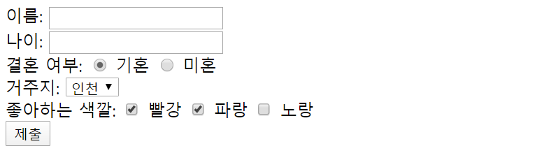
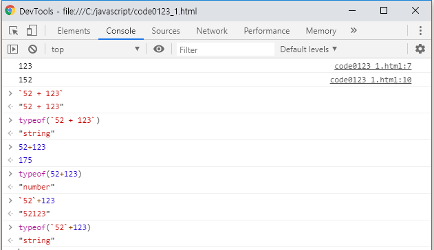
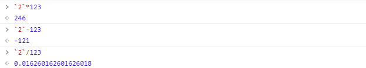
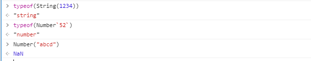
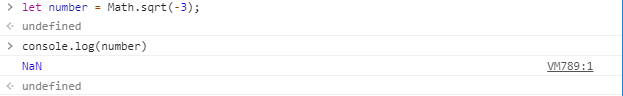
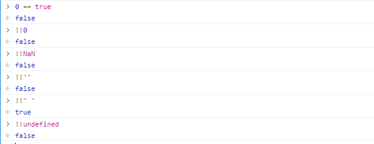

가상화의 문제점

- 불필요한 자원 낭비를 많이함

도커

- 컨테이너 기술

### FORM 태그 하위 요소

``` html
<form action="서버페이지주소">
    <br/>이름: <input type="text" name="name" />
    <br/>나이: <input type="number" name="age" />
    <br/>결혼 여부:
        <input type="radio" name="married" value="Y" checked> 기혼
        <input type="radio" name="married" value="N"> 미혼
    <br/>거주지:
        <select name="city">
            <option value="seoul">서울</option>
            <option value="busan">부산</option>
            <option value="incheon" selected>인천</option>
    </select>
    <br/>좋아하는 색깔:
        <input type="checkbox" name="favColor" value="red" checked> 빨강
        <input type="checkbox" name="favColor" value="blue" checked> 파랑
        <input type="checkbox" name="favColor" value="yellow"> 노랑
    <br/><input type="submit" value="제출"/>
</form>
```



### **prompt()와 confirm()**

```html
prompt()와 confirm()
<script>
let inputNumber = prompt('숫자를 입력하세요');	// 사용자 입력을 받는 코드
console.log(inputNumber);				// 입력받은 값을 콘솔에 출력
alert(inputNumber);					// 입력받은 값을 사용자에게 알림

let yn = confirm('1 + 2 = 3 이 맞습니까?');
console.log(yn);				// 확인을 클릭하면 true, 취소를 클릭하면 false를 반환
</script>
```

실제 서비스에서는 toast와 같은 라이브러리를 활용https://ireade.github.io/Toast.js/




**숫자와 문자열 덧셈 연산은 문자열이 우선**

typeof() - 타입을 확인하는 명령

문자열 + 숫자 = 문자열 + 문자열 로 바뀜

**숫자와 문자열 덧셈을 제외한 사칙 연산은 숫자를 우선시 한다.(묵시적 형변화)**



**명시적 형변환 = 강제적으로 형변환 (반대: 암시적 형변환)**

다른 데이터 타입을 숫자형으로 변환 ⇒ Number() 함수를 사용

다른 데이터 타입을 문자열로 변환 ⇒ String() 함수를 사용



NaN - Not a Number

- 자료형은 숫자이나 자바스크립로 나타낼 수 없는 숫자를 의미
- 예) 자바스크립트에서는 복소수 표현이 불가능



### **P64 Boolean() 함수**

다른 자료형을 불(bool) 자료형으로 변환 -> 명시적인 형변환

-------

0, NaN, '', null, undefined ⇒ false로 변환

나머지 ⇒ true로 변환

****

0, NaN, '', null, undefined 데이터에 대한 암시적인 형변환  ⇒ Boolean() 함수의 결과와 동일




### **P65 일치 연산자** 

```html
<script>
	console.log('' == false);
	console.log('' == 0);
	console.log(0 == false);
	console.log('273' == 273);
</script> 

```

위의 값들은 전부 true로 나오지만 햇갈린다.

자동 형변환(= 암시적 형변환)의 문제점 → 혼돈을 야기

일치 연산자 : 양변의 자료형과 값의 일치 여부를 확인

- === : 양변의 자료형과 값이 모두 일치함

- !== : 양변의 자료형과 값이 일치하지 않음

``` html
<script>
	console.log('' === false);
	console.log('' === 0);
	console.log(0 === false);
	console.log('273' === 273);
</script> 
```

⇒ 모두 false를 반환

``` html
<script>
	const a = "철수";
    const b = "사과";
    console.log('"' + a + '"는 "' + b + '"를 좋아해');
    console.log(`"${a}"는 "${b}"를 좋아해 ... ${a+b} ... `);
</script> 
```


동기방식 = 답이 나와야 다음을 진행

비동기방식 = 답이 안와도 다음을 진행

ex) 호텔 예약때 호텔명이 먼저 나오고 로딩이 끝나면 특징까지 나오면 "비동기" - 아무것도 안나오다가 모든 로딩이 끝나면 호텔 이름과 특징이 같이 나오면 "동기"


### 조건문

``` html
<!DOCTYPE html>
<html>
<head>
    <script>
        const date = new Date();
        const hour = date.getHours();
        const week = date.getDay(); // 요일을 숫자로 반환
 
        console.log('현재는 ' + hour + '시 입니다.');
        console.log(`현재는 ${hour}시 입니다.`);
 
        //  현재 시간이 오전, 오후 여부를 판정
        //  P80 if 구문을 이용한 표현
        /*
        if (hour < 12) {
            console.log('오전입니다.');
        }
        if (hour >= 12) {
            console.log('오후입니다.');
        }
        */
        //  P81 if - else 구문을 이용한 표현
        if (hour < 12) {
            console.log('오전입니다.');
        } else {
            console.log('오후입니다.');
        }
 
        /* 
        if (week == 0) console.log('일요일입니다.');
        if (week == 1) console.log('월요일입니다.');
        if (week == 2) console.log('화요일입니다.');
        if (week == 3) console.log('수요일입니다.');
        if (week == 4) console.log('목요일입니다.');
        if (week == 5) console.log('금요일입니다.');
        if (week == 6) console.log('토요일입니다.');
        */
        //  P85 if - else if 구문을 이용해서 표현
        /*
        if (week == 0) console.log('일요일입니다.');
        else if (week == 1) console.log('월요일입니다.');
        else if (week == 2) console.log('화요일입니다.');
        else if (week == 3) console.log('수요일입니다.');
        else if (week == 4) console.log('목요일입니다.');
        else if (week == 5) console.log('금요일입니다.');
        else console.log('토요일입니다.');
        */
        //  P87 switch 구문을 이용해서 표현
        switch (week) {
            case 0: console.log('일요일입니다.');
                    break;
            case 1: console.log('월요일입니다.');
                    break;
            case 2: console.log('화요일입니다.');
                    break;            
            case 3: console.log('수요일입니다.');
                    break;            
            case 4: console.log('목요일입니다.');
                    break;
            case 5: console.log('금요일입니다.');
                    break;
            case 6: console.log('토요일입니다.');
                    break;
            default: console.log('잘못된 요일입니다.');
                     break;
        }
 
    </script>
</head>
</html>
```


### p89 삼항 연산자 

```html
<!DOCTYPE html>
<html>
<head>
    <script>
        
        // 사용자로 부터 숫자를 입력받습니다.
        // 숫자가 아닌 경우 콘솔에 오류 메시지를 출력하고,
        // 숫자인 경우 짝수, 홀수 여부를 판정해서 콘솔에 메시지를 출력

        let num = prompt("숫자를 입력하세요.");
        num = Number(num);
        if (isNaN(num)) {
            console.log("숫자가 아닙니다.");
        } else {
            if (num % 2 === 0) {
                console.log("짝수입니다.");
            } else {
                console.log("홀수입니다.");
            }
        }

        // 삼항 연사자를 이용해서 구현
        // 조건식 ? 참인경우 : 거짓인경우
        num % 2 === 0 ?
        console.log("짝수입니다.") : console.log("홀수입니다.");

    </script>
</head>
</html>
```


### p89 짧은 조건문(short-circuit)

A || B ⇐ A 또는 B, 둘 중 하나가 참이면 참 = A와 B, 둘 모두 거짓이어야 거짓

A && B ⇐ A와 B, 둘 모두 참이어야 참 = A 또는 B 둘 중 하나가 거짓이면 거짓

```html
    <script>
 
        let breakTime = false;
        breakTime || console.log("공부를 합니다.");
 
    </script>
```

```html
    <script>
        //  입력한 숫자의 홀짝 여부를 판정하는 코드
 
        let input = prompt("숫자를 입력하세요");
 
        //  방법1. if - else 구문을 이용한 구현
        if (input % 2 === 0) {
            console.log("짝수");
        } else {
            console.log("홀수");
        }
 
        //  방법2. 삼항 연산자를 이요한 구현
        input % 2 === 0 ? console.log("짝수") : console.log("홀수");
 
        //  방법3. 짧은 조건문을 이용한 구현
        input % 2 === 0 || console.log("홀수");
        input % 2 === 0 && console.log("짝수");
        
    </script>
```

### p97 반복문

``` html
        for ([1]변수 = 초기값; [2][5]조건문; [4][7]증가분){
            [3][6]조건문을 만족하는 경우 수행할 구문
        }
```


```html
    <script>
        // P98 배열
        //  배열 선언
        let arr = [ 273, 'String', true, function() {}, {}, [ 100, 200 ] ];
        //          숫자  문자열    불    함수           객체  배열
        console.log(arr);
        console.log(arr.length);
 
        // 	배열 항목 추가
        arr.push("xyz");
        console.log("push() 이후 배열의 길이", arr.length);
 
        console.log("방법1");
        console.log(arr[0]);
        console.log(arr[1]);
        console.log(arr[2]);
        console.log(arr[3]);
        console.log(arr[4]);
        console.log(arr[5]);
 
        console.log("방법2");
        for (let i = 0; i < arr.length; i ++) {
            console.log(arr[i]);
        }
 
        console.log("방법3");
        arr.forEach(function(item) { 
            console.log(item); 
        });
 
        console.log("방법4");
        arr.forEach(item => console.log(item)); 
       
    </script>
```


### p102

```html
        // P102 
        let value = 0;
 
        // 현재 시간을 밀리세컨드(1/1000초) 단위로 가져오는 것
        let startTime = new Date().getTime();   
 
        while (new Date().getTime() < startTime + 1000) {
            value ++;
        }
 
        console.log("1초 동안 while 루프를 수행한 횟수 : " + value);
```


```html
    <script>
        //  사용자 입력이 
        //  숫자이면 짝수, 홀수 여부를 콘솔에 출력 후 다시 입력을 요구 
        //  숫자가 아니면 메시지를 콘솔에 출력 후 종료
 
        let input = prompt("숫자를 입력하세요");
        while (!isNaN(input)) {
            input % 2 === 0 ? console.log("짝수") : console.log("홀수");
            input= prompt("숫자를 입력하세요");
        }
        console.log("종료");
    </script>
```


```html
    <script>
        //  숫자 맞추기 게임
        //  1~20 사이의 임의의 숫자를 맞추는 게임
        const MIN = 1;
        const MAX = 20;
 
        let answer = Math.floor(Math.random() * (MAX - MIN + 1)) + MIN;
        let guesses = 0; // 사용자가 입력한 회수
        let input;
        do {
            input = prompt(`${MIN} ~ ${MAX} 사이의 숫자를 입력하세요.`);
            input = Number(input);
            guesses ++;
 
            if (input > answer) {
                console.log("입력한 값 보다 작은 값을 입력하세요");
            } else if (input < answer) {
                console.log("입력한 값 보다 큰 값을 입력하세요");
            } else {
                console.log(`정답입니다. (시도회수: ${guesses})`);
            }
        } while (input !== answer);
    </script>
```


