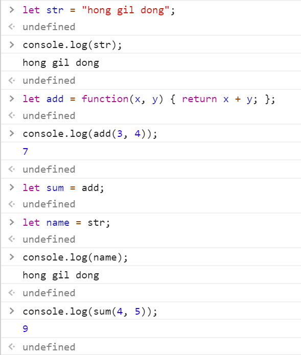
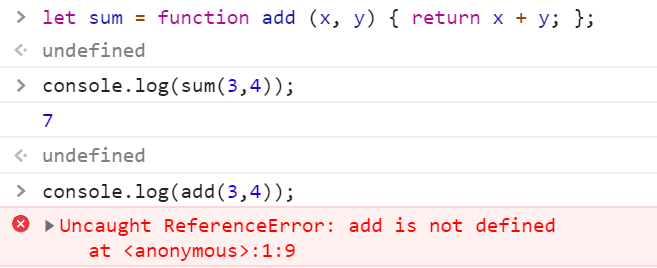

Terminal > New Terminal 메뉴 클릭 > PS C:\javascript> npx http-server

```html
        <script>
            for (let i = 0; i < 10; i ++) {
                console.log(i);
            }
        </script>
```

브라우저(크롬)에서 http://localhost:8080/test.html 로 접속 > 개발자도구(F12) 실행

``` html
<html>
    <head>
        <script>
            /*
                2 * 1 = 2
                2 * 2 = 4
                    :
                2 * 9 = 18
                3 * 1 = 3
                    :
                9 * 9 = 81
            */
            for (let dan = 2; dan <= 9; dan ++) {
                for (let num = 1; num <= 9; num ++) {
                    console.log(`${dan} * ${num} = ${dan * num}`);
                }                
            }
        </script>
    </head>
    <body>
 
    </body>
</html>
```


**사용자 화면에 구구단 출력**

```html
<html>
    <head>
        <script>
            window.onload = function() {
                let div = document.getElementById("display");
                for (let dan = 2; dan <= 9; dan ++) {
                    for (let num = 1; num <= 9; num ++) {
                        // div.innerText = div.innerText + `${dan} * ${num} = ${dan*num}\n`;
                        div.innerText += `${dan} * ${num} = ${dan*num}\n`;

                    }                
                }
            }
        </script>
    </head>
    <body>
        <div id="display"></div>
    </body>
</html>

```

**사용자 화면에 아래와 같은 형식으로 구구단을 출력해 보세요.

2 * 1 = 2	3 * 1 = 3	4 * 1 = 4	5 * 1 = 5	6 * 1 = 6	7 * 1 = 7	8 * 1 = 8	9 * 1 = 9	

2 * 2 = 4	3 * 2 = 6	4 * 2 = 8	5 * 2 = 10	6 * 2 = 12	7 * 2 = 14	8 * 2 = 16	9 * 2 = 18	

2 * 3 = 6	3 * 3 = 9	4 * 3 = 12	5 * 3 = 15	6 * 3 = 18	7 * 3 = 21	8 * 3 = 24	9 * 3 = 27	

2 * 4 = 8	3 * 4 = 12	4 * 4 = 16	5 * 4 = 20	6 * 4 = 24	7 * 4 = 28	8 * 4 = 32	9 * 4 = 36	

2 * 5 = 10	3 * 5 = 15	4 * 5 = 20	5 * 5 = 25	6 * 5 = 30	7 * 5 = 35	8 * 5 = 40	9 * 5 = 45	

2 * 6 = 12	3 * 6 = 18	4 * 6 = 24	5 * 6 = 30	6 * 6 = 36	7 * 6 = 42	8 * 6 = 48	9 * 6 = 54	

2 * 7 = 14	3 * 7 = 21	4 * 7 = 28	5 * 7 = 35	6 * 7 = 42	7 * 7 = 49	8 * 7 = 56	9 * 7 = 63	

2 * 8 = 16	3 * 8 = 24	4 * 8 = 32	5 * 8 = 40	6 * 8 = 48	7 * 8 = 56	8 * 8 = 64	9 * 8 = 72	

2 * 9 = 18	3 * 9 = 27	4 * 9 = 36	5 * 9 = 45	6 * 9 = 54	7 * 9 = 63	8 * 9 = 72	9 * 9 = 81

```html
<html>
    <head>
        <script>
            window.onload = function() {
                let div = document.getElementById("display");
                for (let num = 1; num <= 9; num ++) {
                    for (let dan = 2; dan <= 9; dan ++) {
                        div.innerText = div.innerText + `${dan} * ${num} = ${dan*num} \t`;
                    }                
                    div.innerText = div.innerText + '\n';
                }
            }
        </script>
    </head>
    <body>
        <pre id="display"></pre>
    </body>
</html>

```

**사용자가 입력한 숫자에 해당하는 구구단을 출력해 보세요.**

```html
<html>
    <head>
        <script>
            window.onload = function() {
                let div = document.getElementById("display");
                let dan = prompt("몇 단을 출력할까요?", "2");
                for (let num = 1; num <= 9; num ++) {
                    // div.innerText = div.innerText + `${dan} * ${num} = ${dan*num} \n`;
                    div.innerText += `${dan} * ${num} = ${dan*num} \n`;

                }
            }
        </script>
    </head>
    <body>
        <div id="display"></div>
    </body>
</html>

```


``` html
<html>
    <head>
        <script>
            window.onload = function(){

                const startTime = new Date().getTime();
                let cps = 0;
                for (cps = 0; new Date().getTime() < startTime + 1000; cps ++){

                }
                document.getElementById("display").innerText = `1초 동안 수행된 for 문 회수 : ${cps}`
            }
        
        </script>
    </head>
    <body>
        <pre id = "display"></pre>
    </body>
</html>
```


```html
<script>
            window.onload = function(){

                let fruits = ['사과','딸기','바나나','배'];

                console.log("방법1. for loop");
                for (let i = 0; i < fruits.length; i ++) {
                    console.log(fruits[i]);
                }
        
                console.log("방법2. for in");
                for (let i in fruits) {
                    console.log(fruits[i]);
                }
        
                console.log("방법3. forEach");
                fruits.forEach(function(fruit) { 
                    console.log(fruit);
                });
        
                console.log("방법4. forEach + arrow function");
                fruits.forEach(fruit => console.log(fruit));

            }
</script>
```

**아래와 같은 형식으로 콘솔에 출력해 보세요.**

1

12

123

1234

12345

123456

1234567

12345678

123456789

```html
        <script>
            window.onload = function(){
                let demo ="";
                for (let num = 1; num <=9; num ++) {
                    demo += num;
                    console.log(demo);
                }
            }
        </script>
```


```html
<script>
            window.onload = function() {
                let output = '';
                for (let y = 1; y <= 9; y ++) {
                    output = '';
                    for (let x = 1; x <= y; x ++) {
                        output += x;
                    }
                    console.log(output);
                    document.getElementById("display").innerHTML += output+'<br>';
                }
            }
        </script>

```


**break, continue 문**

``` html
<html>
    <head>
        <script>
            window.onload = function() {
                //  코드 4-18 
                for (let i = 0; true; i ++) {
                    console.log(`${i}번째 반복입니다.`);
                    //  취소 클릭 -> false 반환 -> !false => true -> break 수행
                    if (!confirm("계속할까요?")) {
                        //  반복문을 빠져나올 때 사용하는 구문
                        break;
                    } 
                }
                console.log(`프로그램을 종료합니다.`);
            }
        </script>
    </head>
    <body>
        <div id="display"></div>
    </body>
</html>

```


```html
<html>
    <head>
        <script>
            window.onload = function() {
                for (let i = 0; i < 10; i ++) {
                    console.log("이전", i);
                    if (i % 2 === 0) {
                        continue;
                    }
                    console.log("이후", i);
                }
            }
        </script>
    </head>
    <body>
        <div id="display"></div>
    </body>
</html>

```


**for in 구문 vs for of 구문**

```html
<html>
    <head>
        <script>
            window.onload = function() {
                //  배열에 포함된 숫자의 합을 구하시오.
                const values = [ 100, '백', 200, '이백', 300, '삼백' ];
                let sum = 0;
                // //  for in 구문은 배열의 인덱스를 반환
                // for (let i in values) {
                //     let v = Number(values[i]);
                //     if (!isNaN(v)) {
                //         sum += v;
                //     }
                // }
                //  for of 구문은 배열의 값을 반환
                for (let i of values) {
                    let v = Number(i);
                    if (!isNaN(v)) {
                        sum += v;
                    }
                }
                console.log(`배열에 포함된 숫자의 합은 ${sum}입니다.`);
                document.getElementById("result").innerText = `배열에 포함된 숫자의 합은 ${sum}입니다.`;
            }
        </script>
    </head>
    <body>
        <div id="result"></div>
    </body>
</html>

```

함수 리터럴

#1           #2    #3     #4

function add (x, y) { return x + y; }

\#1 function 키워드

#2 함수명

#3 매개변수 목표 = 파라미터

#4 함수 본문(body)

### 함수 정의 방식

- 함수 선언문 (function statement)
- 함수 표현식 (function expression)
- Function() 생성자 함수 

#### 함수 선언문을 이용한 함수 정의 방식

= 함수 리터럴과 동일

\- 반드시 함수 이름을 정의해야 함

**// 함수 선언**

**function add (x, y) {**

​	**return x + y;**

**}**
**// 함수 호출**

**add(3, 4);**


#### 함수 표현식을 이용한 함수 정의 방식

자바스크립트에서 함수는 하나의 값으로 취급 → 문자열, 숫자 처럼 변수에 할당이 가능

- 함수의 이름이 있는 경우 → 기명 함수 ⇒ 함수 표현식에 사용된 함수 이름은 외부 코드에서 접근할 수 없다.
- 함수의 이름이 없는 경우 → 익명 함수

let str = "hong gil dong";

let add = function (x, y) { return x + y; };

add(3, 4);

let sum = add;

sum(4, 5);



기명 함수 ⇒ 함수 표현식에 사용된 함수 이름은 외부 코드에서 접근할 수 없다.

let sum = function add (x, y) { return x + y; };

console.log(sum(3, 4));

console.log(add(3, 4));




함수 선언문 형식으로 정의한 함수는 자바스크립트 내부에서 함수 이름과 함수 변수 이름이 동일한 함수 표현식 형식으로 변경

function add(x, y) {

​	return x + y;

}
let add = function add(x, y) {

​	return x + y;

};


#### Function() 생성자 함수를 이용한 함수 생성

new Function ([arg1[, arg2[, ...argN]],] functionBody)

https://developer.mozilla.org/ko/docs/Web/JavaScript/Reference/Global_Objects/Function

let add = new Function('x', 'y', 'return x + y');

add(3, 4);

#### P121 익명함수 ⇒ 익명함수 표현식

//	선언

let 함수이름변수 = function (매개변수) { 함수본문 };

//	호출

함수이름변수(매개변수);


1부터 사용자가 입력한 숫자 만큼의 합을 반환하는 함수를 정의

``` html
<html>
    <head>
        <script>
            //  1부터 사용자가 입력한 숫자 만큼의 합을 반환하는 함수를 정의
            function sigma1(n) {
                let sum = 0;
                for (let i = 1; i <= n; i ++) {
                    sum += i;
                }
                return sum;
            }
            let sigma2 = function(n) {
                let sum = 0;
                for (let i = 1; i <= n; i ++) {
                    sum += i;
                }
                return sum;
            };

            let s = "abcd";
            let f = function() { return 'abc'; };

            let sigma3 = (n) => {
                let sum = 0;
                for (let i = 1; i <= n; i ++) {
                    sum += i;
                }
                return sum;
            };

            let num = prompt("숫자를 입력하세요.");
            console.log(`1~${num} 합은 ${sigma1(num)}입니다.`);
            console.log(`1~${num} 합은 ${sigma2(num)}입니다.`);
            console.log(`1~${num} 합은 ${sigma3(num)}입니다.`);
        </script>
    </head>
    <body></body>
</html>

```


#### P123 선언적 함수 ⇒ 함수 선언문 방식으로 생성한 함수

// 선언

function 함수이름 (매개변수) { 함수본문 }

// 호출

함수이름(매개변수);


#### P124 함수 재정의

동일한 이름의 함수가 중복해서 정의되는 것

``` html
<html>
    <head>
        <script>
            // 같은 이름의 함수를 정의하고 호출
            // 선언문형태
            console.log(doSomething(3,4));
            function doSomething(x,y) {return x + y;}
            function doSomething(x,y) {return x * y;}
            
            // 변수가 선언되기 이전에 변수를 사용했기 때문에 오류가 발생한다.
            // 표현식형태
            console.log(doSomething2);          // undefined 
            console.log(doSomething2(3,4));     // doSomthing2 is not a function
            var doSomething2 = function(x,y) {return x+y;}
            var doSomething2 = function(x,y) {return x*y;}
        </script>
    </head>
    <body>
    </body>
</html>
```


### <추천책>

인사이드 자바스크립트

코어 자바스크립트

러닝 자바스크립트

JavaScript Good Parts (PDF)


``` html
<html>
    <head>
        <script>
            //  P125
            //  선언문 형식으로 정의된 함수와 
            //  표현식 형식으로 정의된 익명 함수가 공존하는 경우
            //  --> 선언문 형식이 먼저 생성된 후 익명 함수가 마지막에 생성
            var f = function() { console.log("#1 f is called."); };
            function f() { console.log("#2 f is called."); }

            f();    
        </script>
    </head>
    <body></body>
</html>
```

#### JavaScript Array 전역 객체

https://developer.mozilla.org/ko/docs/Web/JavaScript/Reference/Global_Objects/Array

```html
<html>
    <head>
        <script>
            //  P129
            //  다양한 형식의 매개변수를 전달할 수 있다. (표5-1 참조)
            let arr1 = new Array();
            let arr2 = new Array(10);
            let arr3 = new Array(1, 2, 3, 4);

            console.log(arr1);  //  []
            console.log(arr2);  //  [empty x 10]
            console.log(arr3);  //  [1, 2, 3, 4]
        </script>
    </head>
    <body></body>
</html>

```

#### P130 가변 인자 함수

파라미터(매개변수)의 개수가 변할 수 있는(= 고정되어 있지 않은) 함수→ 함수 객체의 arguments 속성을 이용해서 매개변수를 이용(처리)

```html
<html>
    <head>
        <script>
            //  매개변수로 전달된 숫자값의 합을 구하는 함수를 정의
            function sumAll() {
                console.log(typeof arguments);
                console.log(arguments);
                let sum = 0;
                for (i of arguments) {
                    if (!isNaN(Number(i))) {
                        console.log(i);
                        sum += i;
                    }
                }
                return sum;
            }

            console.log("모든 숫자의 합: " + sumAll(1, "하나", 2, "둘", 3, "셋", 4, 5, 6, 7)); 
        </script>
    </head>
    <body></body>
</html>
```


```html
<html>
    <head>
        <script>
            //  파라미터로 전달된 숫자 중 첫번째 3의 배수를 반환하는 함수를 작성하시오.
            function f1() {
                for (let i of arguments) {
                    if (i % 3 === 0) return i;
                }
            }
            //  예외를 던지지 않고는 forEach()를 중간에 멈출 수 없음
            //  중간에 멈춰야 한다면 forEach()는 적절하지 않음
            // function f2() {
            //     let value;
            //     Array.from(arguments).forEach(i => {
            //         if (i % 3 === 0) {
            //             value = i;
            //             return false;
            //         }
            //     });  
            //     return value; 
            // }
            // function f3() {
            //     let value;
            //     [...arguments].forEach(i => {
            //         if (i % 3 === 0) {
            //             value = i;
            //             return false;
            //         }
            //     });  
            //     return value; 
            // }
//https://developer.mozilla.org/ko/docs/Web/JavaScript/Reference/Global_Objects/Array/find
            function f2() {
                return Array.from(arguments).find(i => i % 3 === 0);  
            }
            function f3() {
                return [...arguments].find(i => i % 3 === 0); 
            }

            let f = f2;
            console.log(f(3));                      // 3
            console.log(f(3, 7, 11));               // 3
			console.log(f(1, 7, 11, 15, 20, 12));   // 15            
            console.log(f(1, 7, 11, 15));           // 15            
        </script>
    </head>
    <body></body>
</html>

```


#### p135 내부함수

```html
<html>
    <head>
        <script>
            //  P135 내부 함수
            //  함수 내부에서 함수를 정의
            /*
            function 외부함수() {

                function 내부함수1 () { ... }

                function 내부함수2 () { ... }

            } 
            */
            //  피타고라스 정리를 이용한 빗변의 길이를 구하는 pythagoras 함수를 정의       
            function pythagoras (width, height) {
                function square(x) {
                    return x * x;
                }   
                return Math.sqrt(square(width) + square(height));
            }
            
            //  같은 이름의 다른 기능을 함수로 구현
            function square(width, height, hypotenuse) {
                if (width * width + height * height === hypotenuse * hypotenuse) 
                    return true;
                else 
                    return false;
            }            
            console.log(pythagoras(3, 4));      //  5


        </script>
    </head>
    <body></body>
</html>

```

#### p139 자기호출함수

```html
<html>
    <head>
        <script>
            let f = function () {
                console.log("#1");
            };
            f();

            // p139 자기 호출 함수
            // 생성하자마자 한번 호출되는 함수
            (function () {
                console.log("#2");
            })();
            
        </script>
    </head>
    <body></body>
</html>
```

#### p139 콜백 함수

``` html
<html>
    <head>
        <script>
            //  P139
            let f1 = function(x, y) { return x + y; };
            f1(2,3);

            function callTenTimes(paramc) {
                for (var i = 0; i < 10; i ++) {
                    paramc();
                }
            }
            var fc = function() {
                console.log('함수 호출');
            }
            callTenTimes(fc);
        </script>
    </head>
    <body></body>
</html>

```

#### p141함수를 리턴하는 함수

``` html
<html>
    <head>
        <script>
            // 함수를 반환하는 함수
            function returnFunction() {
                return function() {
                    console.log("^^");
                };
            }     

            let f = returnFunction();
            console.log(f);

            f();
            returnFunction()();

        </script>
    </head>
    <body></body>
</html>
```

#### p142클로저

``` html
<html>
    <head>
        <script>
            // 클로저
            function f(name) {
                var output = `Hello ${name}!!!`;
                console.log("f() 안", output);
                return function() { console.log(output);};
            }

            let f1 = f('홍길동');
            f1();
            let f2 = f('리차드');
            f2();
        </script>
    </head>
    <body></body>
</html>
```

