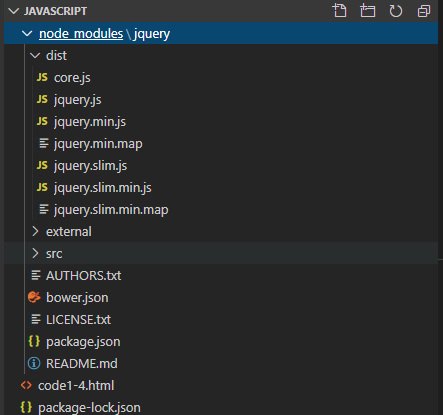
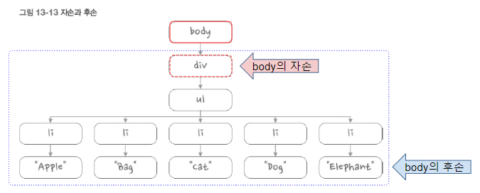

## jQuery

- 모든 브라우저에서 동작하는 클라이언트 자바스크립트 라이브러리
- 2006년 1월, 존 레식이 BarCamp NYC에서 발표
- 무료로 사용 가능한 오픈 소스 라이브러리
- jQuery는 다음 기능을 위해 제작됨
  - 문서 객체 모델과 관련된 처리를 쉽게 구현
  - 일관된 이벤트 연결을 쉽게 구현
  - 시각적 효과를 쉽게 구현
  - ajax 애플리케이션을 쉽게 개발
    - 자바스크립트를 이용해서 서버에 요청을 보낸다.(DATA만 교환) 화면 깜빡임이 없음
- 다운 로드 => https://jquery.com/download/

CDN 사용

소스코드에 추가

``` html
<script src="https://ajax.googleapis.com/ajax/libs/jquery/3.4.1/jquery.min.js"></script>
```

설치해서 사용

C:\javascript>npm install jquery



소스코드에 경로 추가

```html
 <script src="/node_modules/jquery/dist/jquery.js"></script>
```

#### p415 $(document).ready()

```html
    <script>
        //  문서가 준비되면 매개변수로 전달한 콜백 함수를 실행하라는 의미
        window.onload = () => {
            console.log("loaded");
        };
        jQuery(document).ready(function() {
            console.log("#1");
        });
        $(document).ready(function() {
            console.log("#2");
        });      
        jQuery(function() {
            console.log("#3");
        });
        $(function() {
            console.log("#4");
        });
    </script>

```

#### selector(선택자) <- DOM 특정 위치 지정(선택)

CSS 선택자의 대부분을 지원

$("*") => 전체 선택자, all selector

$(".class") => 클래스 선택자

$("#id") => 아이디 선택자

$("element") => 요소(태그, element) 선택자

$("selector1, selector2, ... , seletorN") => 다중 선택자 (multiple selector)

```html
<html>
<head>
    <script src="/node_modules/jquery/dist/jquery.js"></script>
    <script>
        $(function() {
            //  후손 선택자
            //  body 태그 아래의 모든 태그
            $("body *").css('color', 'red');

            //  요소 선택자(element selector)
            //  H1 태그
            $("H1").css('background', 'yellow');

            //  ID 선택자 => 해당 문서에서 유일해야 함
            $("#title").css('border', '1px solid red');

            //  클래스 선택자 
            $(".right").css('textAlign', 'right');

            //  다중 선택자
            $("span, #title, .right").css('text-decoration', 'underline');
        });

        window.onload = () => {
            let ptags = document.getElementsByTagName("p");
            for (let p of ptags) {
                p.innerText = 'ptags';
            }
            
            let title = document.getElementById("title");
            title.style.borderWidth = '3px';
            title.style.borderStyle = 'dotted';
            title.style.borderColor = 'blue';
            
            let rights = document.getElementsByClassName("right");
            for (r of rights) {
                r.style.textAlign = "center";
            }
        }; 
    </script>
</head>
<body>
    <h1 class="right">제목1</h1>
    <p>내용1내용1내용1내용1내용1내용1내용1내용1내용1내용1내용1</p>
    <p>내용1내용1내용1내용1내용1내용1내용1내용1내용1내용1내용1</p>
    <span>다른내용</span>
    <span>다른내용</span>
    <h1 id="title">제목2</h1>
    <p class="right">내용2내용2내용2내용2내용2내용2내용2내용2내용2</p>
    <span>다른내용</span>
    <span>다른내용</span>
</body>
</html>
```

#### p423 자식 선택자, 후손 선택자

https://api.jquery.com/child-selector/

자식 선택자 ⇒ $("parent > child")

후손 선택자 ⇒ $("parent child")



```html
<html>
<head>
    <script src="/node_modules/jquery/dist/jquery.js"></script>
    <script>
        $(function() {
            //  ID가 menu인 ul 태그 아래 있는 모든 li 태그의 값 색깔을 파란색으로 설정
            $("ul#menu li").css('color', 'blue');
            
            //  ID가 menu인 ul 태그 바로 아래 있는 li 태그의 값에 대해 밑줄을 출력
            $("ul#menu > li").css('border', '1px solid red');
        });
    </script>
</head>
<body>
    <div>
        <ul id="menu">
            <li>첫번째</li>
            <li>두번째</li>
            <li>세번째
                <ul>
                    <li>3-1</li>
                    <li>3-2</li>
                    <li>3-3</li>
                </ul>
            </li>
            <li>네번째</li>
        </ul>
    </div>
</body>
</html>
```

p425 속성 선택자

``` html
<html>
<head>
    <script src="/node_modules/jquery/dist/jquery.js"></script>
    <script>
        $(function() {
            //  속성 선택자 
            //  $("엘리먼트이름[속성이름='속성값']")
            //  <form> 아래에서 사용하는 사용자 입력을 처리하는 태그를 제어할 때 사용
            //  <input type="text"> <input type="number"> <input type="radio"> ...
            $('ul[id="submenu"] li').css('color', 'red');
            $('ul#submenu li').css('background', 'yellow');
        });
    </script>
</head>
<body>
    <div>
        <!-- 
            <태그명 속성명="속성값" 속성명="속성값">태그값</태그명>
            태그 => element
            속성 => attribute
        -->
        <ul id="menu">
            <li>첫번째</li>
            <li>두번째</li>
            <li>세번째
                <ul id="submenu">
                    <li>3-1</li>
                    <li>3-2</li>
                    <li>3-3</li>
                </ul>
            </li>
            <li>네번째</li>
        </ul>
    </div>
</body>
</html>
```

#### p425 속성 선택자

```html
<html>
<head>
    <script src="/node_modules/jquery/dist/jquery.js"></script>
    <script>
        $(function() {
            //  속성 선택자 
            //  $("엘리먼트이름[속성이름='속성값']")
            //  <form> 아래에서 사용하는 사용자 입력을 처리하는 태그를 제어할 때 사용
            //  <input type="text"> <input type="number"> <input type="radio"> ...
            $('ul[id="submenu"] li').css('color', 'red');
            $('ul#submenu li').css('background', 'yellow');
        });
    </script>
</head>
<body>
    <div>
        <!-- 
            <태그명 속성명="속성값" 속성명="속성값">태그값</태그명>
            태그 => element
            속성 => attribute
        -->
        <ul id="menu">
            <li>첫번째</li>
            <li>두번째</li>
            <li>세번째
                <ul id="submenu">
                    <li>3-1</li>
                    <li>3-2</li>
                    <li>3-3</li>
                </ul>
            </li>
            <li>네번째</li>
        </ul>
    </div>
</body>
</html>
```


```html
<!DOCTYPE html>
<html>
<head>
    <script src="/node_modules/jquery/dist/jquery.js"></script>
    <script>
        $(function() {
            //  성, 이름 입력창에 OOO을 입력하세요. 문장을 추가
            //  $("#lastName").val('성을 입력하세요.');
            $('input[name="lastName"]').val("성을 입력하세요.");
            $('input[name="firstName"]').val("이름을 입력하세요.");
            /*  
                p426
                https://api.jquery.com/category/selectors/attribute-selectors/
                E[A=V]  속성값이 같은 문서 객체 선택
                E[A!=V] 속성값이 다른 문서 객체 선택
                E[A~=V] 속성값에 단어가 포함된 객체를 선택    
                E[A^=V] 속성값이 글자로 시작하는 객체를 선택
                E[A$=V] 속성값이 글자로 끝나느느 객체를 선택
                E[A*=V] 속성값에 글자를 포함한 객체를 선택
            */

            //  파일 선택창을 제외하고 나머지 입력창에 대해서 (필수입력) 표시
            $('input[type!="file"]').prev().append("(필수입력)").css('color', 'red');

            //  name 속성에 pw이 포함된 것을 검색
            $('input[name~="pw"]').css('background', 'red');

            //  name 속성이 pw로 시작하는 입력창
            $('input[name^="pw"]').css('border', '3px dotted blue');

            //  name 속성이 Name으로 끝나는 입력창
            $('input[name$="Name"]').css('border', '3px solid black');

            //  type 속성에 o가 들어가 있는 입력창을 삭제
            $('input[type*="o"]').hide();
        });
    </script>
</head>
<body>
<form action="#" method="get">
    <label>성</label>
    <input type="text" name="lastName" value=""><br>
    <label>이름</label>
    <input type="text" name="firstName"><br>
    <label>패스워드</label>
    <input type="password" name="pw"><br>
    <label>패스워드(확인)</label>
    <input type="password" name="pw2"><br>
    <label>결혼여부</label>
    <input type="radio" name="ismarried" value="Y"> 네
    <input type="radio" name="ismarried" value="N"> 아니오<br>
    <label>좋아하는 색깔</label>
    <input type="checkbox" name="color" value="red"> 빨강
    <input type="checkbox" name="color" value="blue"> 파랑
    <input type="checkbox" name="color" value="yellow"> 노랑<br>
    <label>사진</label>
    <input type="file" name="photo"><br>
    <input type="submit" value="전송">
</form>
</body>
</html>

```

#### CSS 셀렉터

``` html
<!DOCTYPE html>
<html>
<head>
    <script src="/node_modules/jquery/dist/jquery.js"></script>
    <script>
        $(function() {
            //$("div").css('background','blue');
        });
    </script>
    <style>
        div {
            border: 1px solid black;
            padding: 10px;
            margin: 10px 20px;
            width: auto;
            height: auto;
            font-size: 30px;
            float: left;
        }
        div.num {
            background: gray;
        }
        div.char {
            background: greenyellow;
        }
        div.red {
            color: red;
        }
        div.blue {
            color: blue;
        }
        div.green {
            color: green;
        }
        div.yellow {
            color: yellow;
        }
        /* CSS 속성 선택자 
           ⇒ https://developer.mozilla.org/ko/docs/Web/CSS/Attribute_selectors 
        */
        div[class="char yellow"] {
            background: indigo;
        }
	  /* jQuery Selector에서는 가능하나 CSS에서는 불가 
        div[class="char"][class="yellow"] {
            border: 13px dotted red;
        }
        */
    </style>
</head>
<body>
    <div class="num red">1</div>
    <div class="num blue">2</div>
    <div class="num yellow">3</div>
    <div class="num green">4</div>

    <div class="char red">하나</div>
    <div class="char blue">둘</div>
    <div class="char yellow">셋</div>
    <div class="char green">넷</div>
</body>
</html>

```

#### 셀렉터한 요소들을 순차적으로 처리 및 선택(클릭)한 요소의 값과 속성 출력

```html
<!DOCTYPE html>
<html>
<head>
    <script src="/node_modules/jquery/dist/jquery.js"></script>
    <script>
        $(function() {
            //$("div").css('background','blue');
            //  num : 배경색을 회색
            //  char : 배경색을 적당한 색
            //  red, yellow, green, blue -> 글자색
            $('div.num').css('background', 'gray');
            $('div.char').css('background', '#105090');
            
            /*
            $('div.red').css('color', 'red');
            $('div.blue').css('color', 'blue');
            $('div.green').css('color', 'green');
            $('div.yellow').css('color', 'yellow');
            */

            $('div.num').each(function(index, item) {
                let color = $(item).attr('class').substr(4);
                $(item).css('color', color);
            });

            //  이벤트 핸들링
            $('div#input div').css('cursor','pointer').click(function() {
                let value = $(this).text();
                let attr = $(this).attr('class');
                console.log(value, attr);
                $('#disp').append(value, attr);
            });
        });
    </script>
    <style>
        div {
            border: 1px solid black;
            padding: 10px;
            margin: 10px 20px;
            width: auto;
            height: auto;
            font-size: 30px;
            float: left;
        }
    </style>
</head>
<body>
    <div id="disp"></div>

    <div id="input">
        <div class="num red">1</div>
        <div class="num blue">2</div>
        <div class="num yellow">3</div>
        <div class="num green">4</div>

        <div class="char red">하나</div>
        <div class="char blue">둘</div>
        <div class="char yellow">셋</div>
        <div class="char green">넷</div>
    </div>
</body>
</html>

```


#### 동일한 속성값을 가진 엘리먼트를 토글링

```html
<!DOCTYPE html>
<html>
<head>
    <script src="/node_modules/jquery/dist/jquery.js"></script>
    <script>
        $(function() {
            // div 박스를 클릭하면 동일한 value가 
            //  화면에 있으면 다른 class의 박스를 숨기(hide)
            //  화면에 없으면 다른 class의 박스를 보임(show)
            $('div').click(function() {
                let cls = $(this).attr('class');
                let val = $(this).attr('value');

                //  현재 클릭된 div와 value가 같고 class가 다른 div를 선택
                let div = $('div[value="'+val+'"][class!="'+cls+'"]');
                /*
                if (div.is(':visible')) {
                    div.hide();
                } else {
                    div.show();
                }
                */
                div.toggle();
            });
        });
    </script>
    <style>
        div {
            border: 1px solid black;
            padding: 10px;
            margin: 10px 20px;
            width: auto;
            height: auto;
            font-size: 30px;
            float: left;
        }
    </style>
</head>
<body>
    <div class="no" value="1">1</div>
    <div class="no" value="2">2</div>
    <div class="no" value="3">3</div>
    <div class="no" value="4">4</div>

    <div class="ch" value="1">one</div>
    <div class="ch" value="2">two</div>
    <div class="ch" value="3">three</div>
    <div class="ch" value="4">four</div>
    
</body>
</html>

```


#### 셀렉트 박스에서 선택한 숫자에 해당하는 구구단을 출력

``` html

<!DOCTYPE html>
<html>
<head>
    <script src="/node_modules/jquery/dist/jquery.js"></script>
    <script>
        $(function() {
            $('select').change(function(){
                $('div').empty(); // 이전 내용 지우고 출력
                let dan = $(this).val();
                // console.log($(this).text());  text 사용시 전부 출력 ㅠ
                for (let i = 1; i <= 9; i++) {
                    $('div').append(`${dan} * ${i} = ${dan * i} <br>`)
                }
            });
        });
    </script>
    <style>        
    </style>
</head>
<body>
    <select>
        <option value="">선택하세요.</option>
        <option value="1">1</option>
        <option value="2">2</option>
        <option value="3">3</option>
        <option value="4">4</option>
        <option value="5">5</option>
        <option value="6">6</option>
        <option value="7">7</option>
        <option value="8">8</option>
        <option value="9">9</option> 
    </select>
    <div></div>
</body>
</html>

```


#### mouseover, mouseleave 이벤트 처리

```html
<!DOCTYPE html>
<html>
<head>
    <script src="/node_modules/jquery/dist/jquery.js"></script>
    <script>
        $(function() {
            // P430
            // 홀수번째 : red
            // 짝수번째 : blue
            // 첫번째 : yellow
            // 마지막은 : green
            $('div:odd').css('background', 'red');
            $('div:even').css('background', 'blue');
            $('div:first').css('background', 'yellow');
            $('div:last').css('background', 'green');
            // div 태그 내부에 마우스가 들어가면 배경색을 붉은 색으로
            // 빠져나오면 원래 색깔로 변경
            // $('div')
            // .mouseover(function() {
            //     console.log('진입');
            // })
            // .mouseleave(function() {
            //     console.log('진출');
            // });

            let orgColor;
            $('div').mouseover(function() {
                orgColor = $(this).css('background');
                console.log($(this).text());
                $(this).text('abce');

                $(this).attr('test', 'testvalue');
                console.log($(this).attr('test'));

                $(this).css('background', 'black');
            }).mouseleave(function(){
                $(this).css('background',orgColor);
            });
        });
    </script>
    <style>        
        div {
            width : 200px;
            height: 200px;
            border: 1px solid blue;
            float : left;
            margin: 20px;
        }
    </style>
</head>
<body>
    <div></div>
    <div></div>
    <div></div>
    <div></div>
</body>
</html>

```


#### jQuery UI

https://jqueryui.com/ - ui 기능들을 쉽게 만들 수 있도록 도와준다.

npm i jquery-ui-css

```
C:\javascript>npm install jquery-ui
npm WARN javascript@1.0.0 No description
npm WARN javascript@1.0.0 No repository field.

+ jquery-ui@1.12.1
added 1 package from 1 contributor and audited 181 packages in 3.432s

1 package is looking for funding
  run `npm fund` for details

found 0 vulnerabilities

C:\javascript>npm install jquery-ui-css
npm WARN javascript@1.0.0 No description
npm WARN javascript@1.0.0 No repository field.

+ jquery-ui-css@1.11.5
added 1 package from 1 contributor and audited 182 packages in 1.195s

1 package is looking for funding
  run `npm fund` for details

found 0 vulnerabilities
```


```html
<!DOCTYPE html>
<html>
<head>
    <script src="/node_modules/jquery/dist/jquery.js"></script>
    <script>
        $(function() {
            $('div').mouseover(function() {
                $(this).attr('class', 'mycolor1');
            }).mouseleave(function() {
                $(this).attr('class', 'mycolor2');
            }); 
        });
    </script>
    <style>
        div { width: 100px; height: 100px; float: left; border: 1px solid red; }
        .mycolor1 { background: red; }
        .mycolor2 { background: blue; }
    </style>
</head>
<body>    
    <div>1111</div>
    <div>2222</div>
</body>
</html>

```

#### UI 테마를 적용

https://jqueryui.com/themeroller/

```html
<!DOCTYPE html>
<html>
<head>
    <link rel="stylesheet" href="/jquery-ui-1.12.1/jquery-ui.css">
    <link rel="stylesheet" href="/jquery-ui-1.12.1/jquery-ui.theme.css">
    <script src="/jquery-ui-1.12.1/external/jquery/jquery.js"></script>
    <script src="/jquery-ui-1.12.1/jquery-ui.js"></script>
    <script>
        $(function() {
            $("#tabs").tabs();
        });
    </script>
    <style>        
    </style>
</head>
<body>    
    <div id="tabs">
        <ul>
          <li><a href="#matzip">맛집예약</a></li>
          <li><a href="#hospital">병원예약</a></li>
          <li><a href="#car">공유자동차예약</a></li>
        </ul>
        <div id="matzip">
          <p>맛집 예약과 관련한 컨텐츠</p>
        </div>
        <div id="hospital">
          <p>병원 예약과 관련한 컨텐츠</p>
        </div>
        <div id="car">
          <p>공유자동차 예약과 관련한 컨텐츠</p>
        </div>
    </div>
</body>
</html>

```

toast.js 적용https://github.com/kamranahmedse/jquery-toast-plugin/

C:\javascript>npm install jquery-toast-plugin

npm WARN javascript@1.0.0 No description

npm WARN javascript@1.0.0 No repository field.

\+ jquery-toast-plugin@1.3.2added 1 package and audited 183 packages in 1.043s

1 package is looking for funding run `npm fund` for details

found 0 vulnerabilities


```html
<!DOCTYPE html>
<html>
<head>
    <link rel="stylesheet" href="node_modules/jquery-ui-1.12.1.custom/jquery-ui.css">
    <link rel="stylesheet" href="node_modules/jquery-ui-1.12.1.custom/jquery-ui.theme.css">
    <link rel="stylesheet" href="node_modules/jquery-toast-plugin/dist/jquery.toast.min.css">
    <script src="node_modules/jquery-ui-1.12.1.custom/external/jquery/jquery.js"></script>
    <script src="node_modules/jquery-ui-1.12.1.custom/jquery-ui.js"></script>
    <script src="node_modules/jquery-toast-plugin/dist/jquery.toast.min.js"></script>
    <script>
        $(function() {
            $("#tabs").tabs();

            $('input[name="userid"]').focusout(function() {
                if ($(this).val() == "") {
                    // $("#dialog").dialog();
                    $.toast({
                        text: "아이디를 입력하세요.",
                        showHideTransition : 'fade', 
   
                    });
                }
            });
        });
    </script>
    <style>        
    </style>
</head>
<body>    
    <div id="tabs">
        <ul>
          <li><a href="#matzip">맛집예약</a></li>
          <li><a href="#hospital">병원예약</a></li>
          <li><a href="#car">공유자동차예약</a></li>
        </ul>
        <div id="matzip">
          Proin elit arcu, rutrum commodo, vehicula tempus, commodo a, risus. Curabitur nec arcu. Donec sollicitudin mi sit amet mauris. Nam elementum quam ullamcorper ante. Etiam aliquet massa et lorem. Mauris dapibus lacus auctor risus. Aenean tempor ullamcorper leo. Vivamus sed magna quis ligula eleifend adipiscing. Duis orci. Aliquam sodales tortor vitae ipsum. Aliquam nulla. Duis aliquam molestie erat. Ut et mauris vel pede varius sollicitudin. Sed ut dolor nec orci tincidunt interdum. Phasellus ipsum. Nunc tristique tempus lectus.
        </div>
        <div id="hospital">
          <p>Morbi tincidunt, dui sit amet facilisis feugiat, odio metus gravida ante, ut pharetra massa metus id nunc. Duis scelerisque molestie turpis. Sed fringilla, massa eget luctus malesuada, metus eros molestie lectus, ut tempus eros massa ut dolor. Aenean aliquet fringilla sem. Suspendisse sed ligula in ligula suscipit aliquam. Praesent in eros vestibulum mi adipiscing adipiscing. Morbi facilisis. Curabitur ornare consequat nunc. Aenean vel metus. Ut posuere viverra nulla. Aliquam erat volutpat. Pellentesque convallis. Maecenas feugiat, tellus pellentesque pretium posuere, felis lorem euismod felis, eu ornare leo nisi vel felis. Mauris consectetur tortor et purus.</p>
        </div>
        <div id="car">
          <p>Mauris eleifend est et turpis. Duis id erat. Suspendisse potenti. Aliquam vulputate, pede vel vehicula accumsan, mi neque rutrum erat, eu congue orci lorem eget lorem. Vestibulum non ante. Class aptent taciti sociosqu ad litora torquent per conubia nostra, per inceptos himenaeos. Fusce sodales. Quisque eu urna vel enim commodo pellentesque. Praesent eu risus hendrerit ligula tempus pretium. Curabitur lorem enim, pretium nec, feugiat nec, luctus a, lacus.</p>
          <p>Duis cursus. Maecenas ligula eros, blandit nec, pharetra at, semper at, magna. Nullam ac lacus. Nulla facilisi. Praesent viverra justo vitae neque. Praesent blandit adipiscing velit. Suspendisse potenti. Donec mattis, pede vel pharetra blandit, magna ligula faucibus eros, id euismod lacus dolor eget odio. Nam scelerisque. Donec non libero sed nulla mattis commodo. Ut sagittis. Donec nisi lectus, feugiat porttitor, tempor ac, tempor vitae, pede. Aenean vehicula velit eu tellus interdum rutrum. Maecenas commodo. Pellentesque nec elit. Fusce in lacus. Vivamus a libero vitae lectus hendrerit hendrerit.</p>
        </div>
    </div>

    <label>아이디</label>
    <input type="text" name="userid" />

    <div id="dialog" title="알림">
        <p>아이디를 입력하지 않았습니다.</p>
    </div>    
</body>
</html>

```

#### P588 colorbox 플러그인 사용

https://www.jacklmoore.com/colorbox/

C:\javascript>npm install jquery-colorbox

### ajax

#### ajax 통신을 통해 가져온 데이터를 화면에 출력

```json
### students.json
{
    "students" : 
        [
            { "name": "홍길동", "age": 23, "score": "A+" },
            { "name": "길동홍", "age": 32, "score": "B+" },
            { "name": "동홍길", "age": 43, "score": "C+" }            
        ]
}

```


```html
<!DOCTYPE html>
<html>
<head>
    <script src="/node_modules/jquery/dist/jquery.js"></script>
    <script>
        $(function() {
            $('button').click(function() {
                $.ajax({
                    url: "http://localhost:8080/students.json", 
                    type: "GET", 
                    dataType: "json"
                })
                .done(function(res) {
                    res.students.forEach(student => {
                        let x = `
                            <tr>
                                <td>${student.name}</td>
                                <td>${student.age}</td>
                                <td>${student.score}</td>
                            </tr>
                        `;
                        $('table').html($('table').html() + x);
                    });
                });
            });
        });
    </script>
</head>
<body>    
    <button>가져오기</button>
    <table border="1"></table>   
</body>
</html>

```


